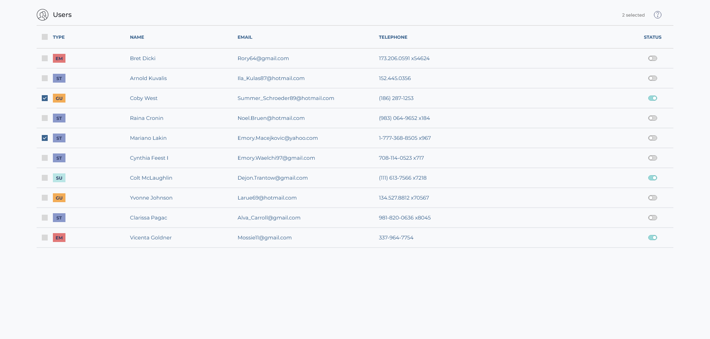

# Monospace Web Lab | Pantelis Liafas Assignment

This is a solution to an assignment by Monospace Web Lab.

## Table of contents

-   [Overview](#overview)
    -   [Details](#details)
    -   [Screenshot](#screenshot)
-   [My process](#my-process)
    -   [Built with](#built-with)
-   [Author](#author)

## Overview

### Details

-   The solution does not include status toggle functionality
-   Total time: ~6 hours

### Screenshot

## My process

### Built with

-   React
-   Redux Toolkit
-   Tailwind CSS

## Author

-   LinkedIn - [Pantelis Liafas](https://www.linkedin.com/in/pantelis-liafas/)
